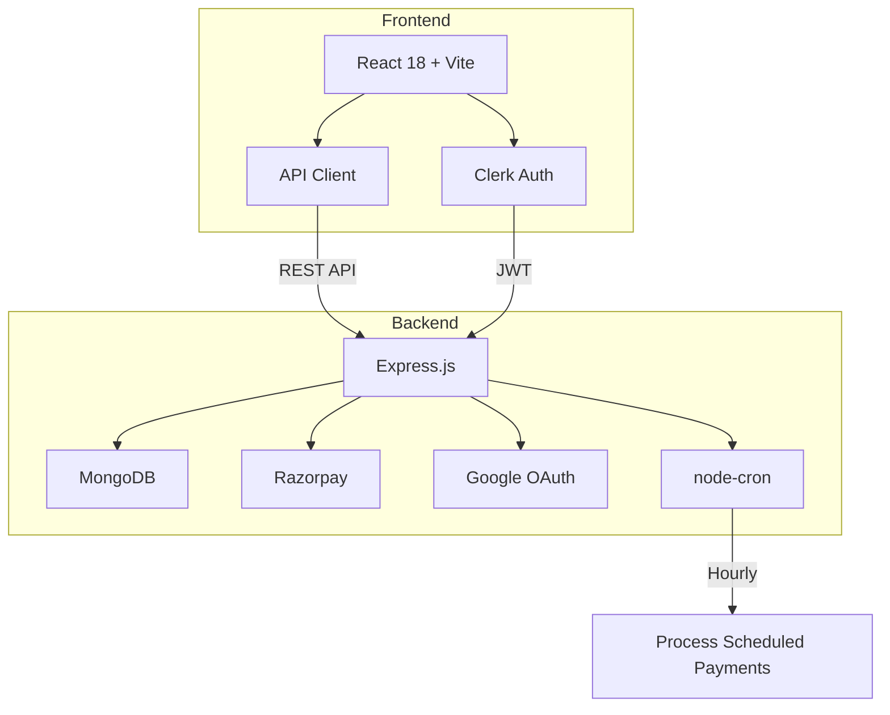
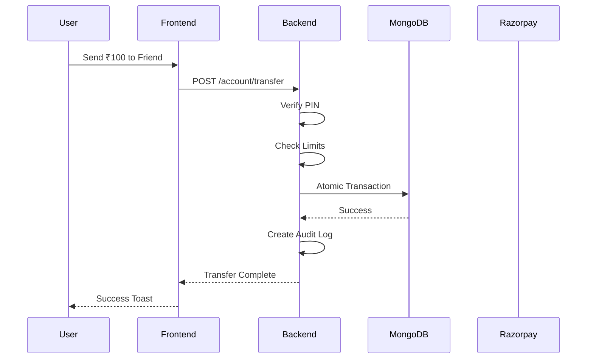
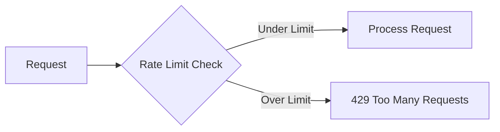
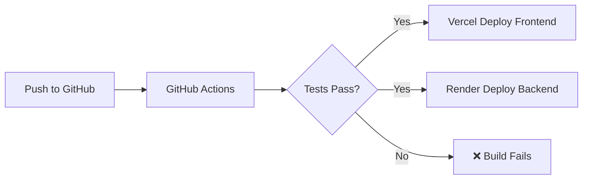

# 💰 PayTM Clone - Digital Wallet Application

A production-ready digital wallet application with secure transactions, scheduled payments, request money, and more.


---

## 📋 Table of Contents

- [Features](#-features)
- [Architecture](#-architecture)
- [Tech Stack](#-tech-stack)
- [Installation](#-installation)
- [Configuration](#-configuration)
- [API Reference](#-api-reference)
- [Security Features](#-security-features)
- [Screenshots](#-screenshots)

---

## ✨ Features

### 💳 Core Wallet Features
| Feature | Description |
|---------|-------------|
| **Add Money** | Add funds via Razorpay (UPI/Card/NetBanking) |
| **Send Money** | Instant P2P transfers with PIN verification |
| **Withdraw** | Withdraw to bank via RazorpayX |
| **QR Payments** | Scan QR codes or generate your payment QR |

### 📅 Advanced Features
| Feature | Description |
|---------|-------------|
| **Scheduled Payments** | One-time or recurring auto-payments |
| **Request Money** | Send payment requests, accept/decline |
| **Beneficiaries** | Save favorites for quick one-tap payments |
| **Statement Download** | Export transaction history as CSV |
| **Transaction PIN** | 4-digit PIN for all transfers |

### 🔐 Security
| Feature | Description |
|---------|-------------|
| **Clerk Auth** | Secure session-based authentication |
| **Rate Limiting** | Protects against brute-force attacks |
| **Transaction Limits** | ₹10K per tx / ₹50K daily / ₹500K monthly |
| **Audit Logging** | Track all sensitive operations |
| **PIN Lock** | Account locks after 3 wrong PIN attempts |

### 🎨 UX Enhancements
| Feature | Description |
|---------|-------------|
| **Dark Mode** | System preference + manual toggle |
| **Toast Notifications** | Elegant feedback with react-hot-toast |
| **Skeleton Loaders** | Smooth loading states |
| **Google Contacts** | Import contacts from Google |

---

## 🏗 Architecture



### Data Flow



---

## 🛠 Tech Stack

### Backend
```
├── Express.js        # Web framework
├── MongoDB           # Database
├── Mongoose          # ODM
├── Clerk             # Authentication
├── Razorpay          # Payments
├── node-cron         # Scheduled payments
├── bcrypt            # PIN hashing
├── Zod               # Validation
└── express-rate-limit
```

### Frontend
```
├── React 18          # UI framework
├── Vite              # Build tool
├── TailwindCSS       # Styling
├── React Router      # Navigation
├── @clerk/clerk-react
├── react-hot-toast   # Notifications
├── html5-qrcode      # QR scanning
└── qrcode.react      # QR generation
```

---

## 🚀 Installation

### Prerequisites
- Node.js 18+
- MongoDB (local or Atlas)
- Clerk account
- Razorpay account (test mode)

### Quick Start

```bash
# Clone repository
git clone https://github.com/yourusername/paytm-clone.git
cd paytm-clone

# Install backend
cd backend
npm install
cp .env.example .env
# Edit .env with your credentials

# Start backend
npm start

# Install frontend (new terminal)
cd frontend
npm install
cp .env.example .env

# Start frontend
npm run dev
```

### Access Application
Open `http://localhost:5173`

---

## ⚙️ Configuration

### Backend Environment Variables

```env
# MongoDB
MONGODB_URI=mongodb://localhost:27017/paytm

# Clerk (from dashboard.clerk.com)
CLERK_SECRET_KEY=sk_test_xxxxx

# Razorpay (from dashboard.razorpay.com)
RAZORPAY_KEY_ID=rzp_test_xxxxx
RAZORPAY_KEY_SECRET=xxxxx

# Google OAuth (from console.cloud.google.com)
GOOGLE_CLIENT_ID=xxxxx.apps.googleusercontent.com
GOOGLE_CLIENT_SECRET=xxxxx
GOOGLE_REDIRECT_URI=http://localhost:3000/api/v1/google/callback
```

### Frontend Environment Variables

```env
VITE_CLERK_PUBLISHABLE_KEY=pk_test_xxxxx
```

---

## 📡 API Reference

### Authentication
All protected routes require Clerk session token in header.

### Wallet Operations

| Method | Endpoint | Description |
|--------|----------|-------------|
| GET | `/account/balance` | Get wallet balance |
| POST | `/account/transfer` | Send money (requires PIN) |
| GET | `/account/transactions` | Transaction history |

### Scheduled Payments

| Method | Endpoint | Description |
|--------|----------|-------------|
| GET | `/scheduled` | List all scheduled payments |
| POST | `/scheduled` | Create scheduled payment |
| PATCH | `/scheduled/:id/toggle` | Pause/Resume payment |
| DELETE | `/scheduled/:id` | Cancel payment |

### Request Money

| Method | Endpoint | Description |
|--------|----------|-------------|
| GET | `/requests` | Get sent & received requests |
| POST | `/requests` | Create payment request |
| POST | `/requests/:id/pay` | Pay a request |
| POST | `/requests/:id/decline` | Decline request |

### Beneficiaries

| Method | Endpoint | Description |
|--------|----------|-------------|
| GET | `/beneficiaries` | List saved contacts |
| POST | `/beneficiaries` | Add beneficiary |
| DELETE | `/beneficiaries/:id` | Remove beneficiary |

### PIN Management

| Method | Endpoint | Description |
|--------|----------|-------------|
| GET | `/pin/status` | Check if PIN is set |
| POST | `/pin/set` | Set transaction PIN |
| POST | `/pin/verify` | Verify PIN |
| POST | `/pin/reset` | Reset PIN (after OTP) |

---

## 🔒 Security Features

### Rate Limiting



| Route | Limit | Window |
|-------|-------|--------|
| `/user/signin` | 5 attempts | 15 minutes |
| `/user/signup` | 10 attempts | 1 hour |
| `/account/transfer` | 20 transfers | 1 hour |
| `/razorpay/payout` | 5 withdrawals | 24 hours |

### Transaction Limits

| Type | Limit |
|------|-------|
| Per Transaction | ₹10,000 |
| Daily | ₹50,000 |
| Monthly | ₹5,00,000 |

### PIN Security
- 4-digit numeric PIN required for all transfers
- bcrypt hashed in database
- Account locks for 30 minutes after 3 wrong attempts
- PIN reset via email OTP

---

## 📁 Project Structure

```
paytm-complete-solution/
├── backend/
│   ├── routes/
│   │   ├── account.js       # Wallet operations
│   │   ├── beneficiary.js   # Saved contacts
│   │   ├── google.js        # OAuth & contacts
│   │   ├── pin.js           # PIN management
│   │   ├── razorpay.js      # Payments
│   │   ├── requests.js      # Request money
│   │   ├── scheduled.js     # Auto-payments
│   │   ├── security.js      # Audit logs
│   │   ├── statement.js     # CSV export
│   │   └── user.js          # Auth & profile
│   ├── services/
│   │   ├── auditLog.js
│   │   ├── scheduler.js     # Cron jobs
│   │   └── transactionLimits.js
│   ├── middleware/
│   │   └── rateLimit.js
│   └── db.js                # Mongoose schemas
│
├── frontend/
│   ├── src/
│   │   ├── pages/
│   │   │   ├── Dashboard.jsx
│   │   │   ├── SendMoney.jsx
│   │   │   ├── RequestMoney.jsx
│   │   │   ├── ScheduledPayments.jsx
│   │   │   ├── Beneficiaries.jsx
│   │   │   ├── TransactionHistory.jsx
│   │   │   ├── ChangePin.jsx
│   │   │   └── ...
│   │   ├── components/
│   │   │   ├── Appbar.jsx
│   │   │   ├── Skeleton.jsx
│   │   │   ├── ThemeToggle.jsx
│   │   │   └── ...
│   │   ├── hooks/
│   │   │   └── useTheme.js
│   │   └── utils/
│   │       ├── api.js
│   │       └── toast.js
```

---

## 🧪 Testing

### Test Razorpay Payments

| Type | Test Value |
|------|------------|
| Card Number | `4111 1111 1111 1111` |
| UPI ID | `success@razorpay` |
| Expiry | Any future date |
| CVV | Any 3 digits |

---

## 🚀 Deployment

### Frontend → Vercel

1. **Connect GitHub repo** to [vercel.com](https://vercel.com)
2. **Set root directory** to `frontend`
3. **Add environment variable:**
   ```
   VITE_CLERK_PUBLISHABLE_KEY = pk_test_xxxxx
   ```
4. **Deploy!** Auto-deploys on every push to `main`

### Backend → Render

1. **Connect GitHub repo** to [render.com](https://render.com)
2. **Create Web Service** → select your repo
3. **Set build command:** `cd backend && npm install`
4. **Set start command:** `cd backend && npm start`
5. **Add environment variables:**
   ```
   MONGODB_URI
   CLERK_SECRET_KEY
   RAZORPAY_KEY_ID
   RAZORPAY_KEY_SECRET
   GOOGLE_CLIENT_ID
   GOOGLE_CLIENT_SECRET
   ```
6. **Deploy!** Auto-deploys on every push to `main`

### CI/CD Pipeline



---

## ✅ Feature Checklist

- [x] Clerk Authentication
- [x] Rate Limiting (4 tiers)
- [x] Transaction Limits
- [x] Audit Logging
- [x] Toast Notifications
- [x] Dark Mode
- [x] Skeleton Loaders
- [x] Beneficiary Management
- [x] Statement Download (CSV)
- [x] Scheduled Payments (auto-process hourly)
- [x] Request Money
- [x] Transaction PIN
- [x] Change PIN via Email OTP
- [x] QR Scan & Pay
- [x] Google Contacts Import

---

## 📄 License

MIT License - feel free to use for learning!

---

## 🤝 Contributing

Pull requests welcome! For major changes, open an issue first.

---

Made with ❤️ for learning purposes
